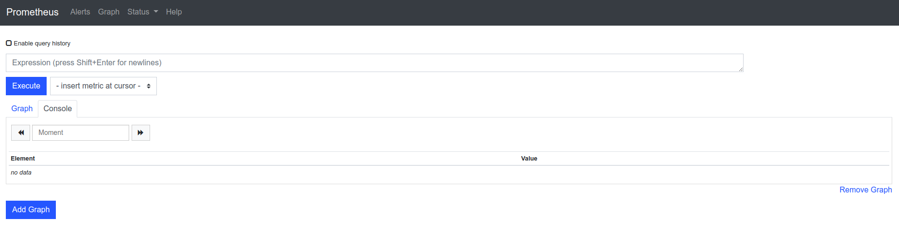

# Exercise 3


## Introduction

Even if you know how to fix a memory leak,
you would have preferred not having to!

Monitoring your application is the key.

In this exercise, you will start a Prometheus,
make it scrape your application, and create an alert.


### Start

Run the exercise application

```
npm run start-exercise-3
```

In another terminal, run the docker image "prom/prometheus"

```
docker run \
  --network host \
  --volume "/prometheus" \
  --volume "$(pwd)/src/exercise-3/prometheus-data:/prometheus-data" \
  prom/prometheus \
    --storage.tsdb.path=/prometheus-data/storage \
    --config.file=/prometheus-data/prometheus.yml 
```

Open http://localhost:9090, you should see the prometheus interface




### Graphing


#### Prerequisites

Have a look at the [prometheus queries][]!


#### Watch the heap!

From there, create graphs showing
the heap spaces sizes over 5 minutes.

<details>
<summary>Solution</summary>
<p>

 - click on "add graph" to get 2 graphs
 - switch to graph mode for both
 - enter the following queries
   ```
   nodejs_heap_space_size_used_bytes{space="new"}
   ```
   and
   ```
   nodejs_heap_space_size_used_bytes{space="old"}
   ```
 - press "execute" for both

</p>
</details>


#### Watch the GC!

Create another graph on the same page showing
the garbage collector reclaimed bytes increase per minute over 5 minutes..

<details>
<summary>Solution</summary>
<p>

 - click on "add graph"
 - switch to graph mode
 - enter the following query
   ```
   increase(nodejs_gc_reclaimed_bytes_total{}[1m])
   ```
 - check "stacked"
 - press "execute"

Eventually, you should reach this [state](http://localhost:9090/graph?g0.range_input=5m&g0.stacked=0&g0.expr=nodejs_heap_space_size_used_bytes%7Bspace%3D%22new%22%7D&g0.tab=0&g1.range_input=5m&g1.expr=nodejs_heap_space_size_used_bytes%7Bspace%3D%22old%22%7D&g1.tab=0&g2.range_input=5m&g2.expr=increase(nodejs_gc_reclaimed_bytes_total%7B%7D%5B1m%5D)&g2.tab=0).

</p>
</details>


[prometheus queries]: https://prometheus.io/docs/prometheus/latest/querying/basics/
